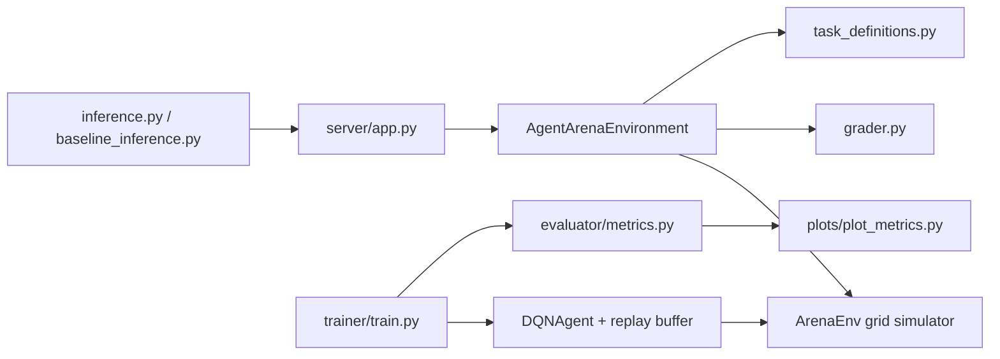
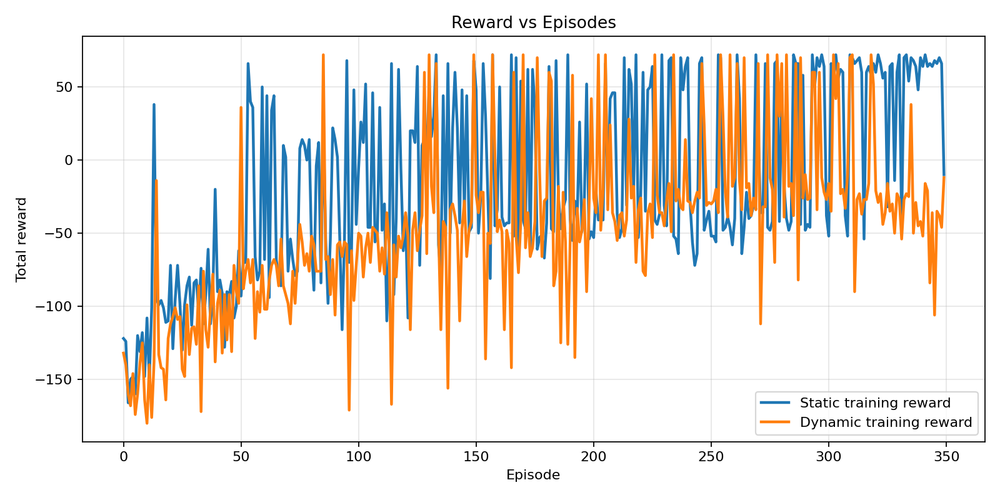
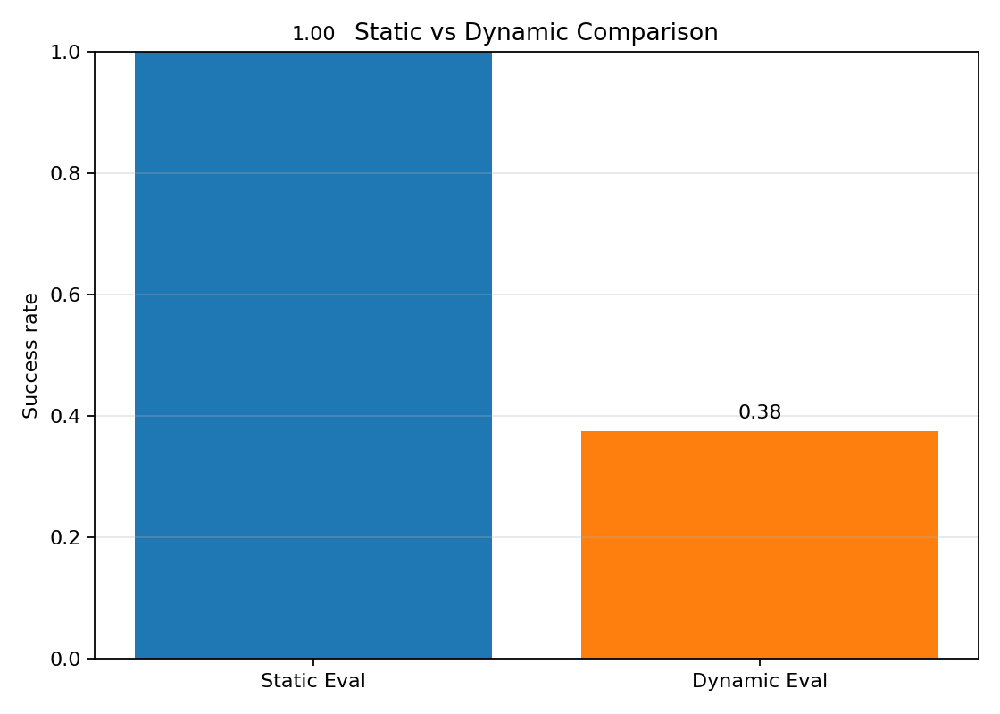
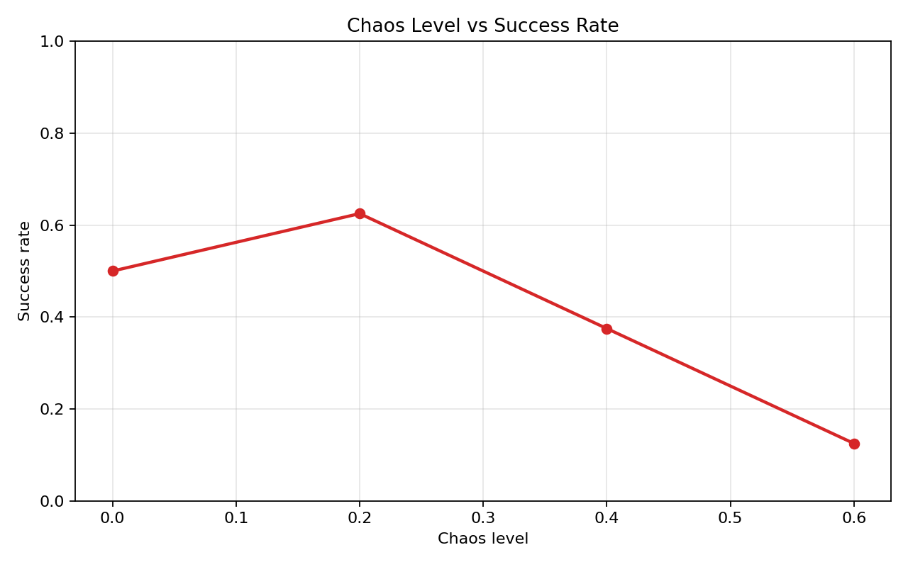

# Agent Arena: Dynamic Facility Operations

Agent Arena is an OpenEnv benchmark for stress-testing a maintenance rover in a secure industrial facility. The mission is deliberately multi-stage:

1. collect an access badge
2. unlock a safety gate
3. reach the active service checkpoint
4. recover when the checkpoint reroutes or a new blockage appears mid-episode

The repository now satisfies the Round 1 OpenEnv checklist end to end: real-world framing, typed models, `openenv.yaml`, 3 graded tasks, normalized rewards, a root `inference.py`, Docker deployment, Hugging Face Space metadata, and reproducible experiment artifacts.

## Why This Environment Matters

This benchmark is built to measure planning and adaptability rather than simple movement:

- Sequential dependency: the rover cannot finish without badge pickup before gate unlock.
- Dynamic disruption: the checkpoint can move and a fresh obstacle can be introduced after the episode has already started.
- Partial-credit grading: the evaluator gives useful signal for progress, not just all-or-nothing success.
- Curriculum support: `/reset` accepts `difficulty_scale` in `[0, 1]` to interpolate chaos, reroute timing, and step budget.

## Task Catalog

| Task ID | Difficulty | What Changes | Success Criteria | Expected Baseline |
|---|---|---|---|---|
| `easy_facility_reset` | easy | static checkpoint | Collect badge, open gate, reach checkpoint within budget | `0.94 - 0.99` |
| `medium_reroute_response` | medium | checkpoint reroutes at step 8 | Finish the full sequence even after the checkpoint moves | `0.60 - 0.92` |
| `hard_disruption_recovery` | hard | checkpoint reroutes and an obstacle may appear | Recover from reroutes and aisle disruption before timeout | `0.68 - 0.82` |

Evaluation dimensions are exposed directly in the observation/task metadata:

- easy: sequencing, goal completion, efficiency
- medium: planning, adaptation, reroute recovery, efficiency
- hard: long-horizon planning, adaptation, robustness, efficiency

## Reward And Grading Design

The underlying simulator keeps dense learning rewards:

- `+10` badge pickup
- `+10` gate unlock
- `+50` checkpoint completion
- `-1` per step
- `-5` invalid action

The OpenEnv-facing grader normalizes outcomes to the strict open interval `(0, 1)`:

- `0.30` badge milestone
- `0.30` gate milestone
- `0.30` checkpoint milestone
- up to `0.10` efficiency bonus

This keeps the training signal dense while making task-level scores easy to compare across tasks.

## Architecture



Core files:

- `openenv.yaml`
- `models.py`
- `server/app.py`
- `server/agent_arena_environment.py`
- `agent_arena/openenv/task_definitions.py`
- `agent_arena/openenv/grader.py`
- `inference.py`

## OpenEnv Interface

Supported endpoints:

- `POST /reset`
- `POST /step`
- `GET /state`
- `GET /schema`
- `GET /metadata`
- `GET /health`
- `POST /mcp`
- `GET /env-info`
- `WS /ws`

Notable implementation details:

- `/state` now returns the real active HTTP session state instead of a throwaway environment.
- `/env-info` exposes task metadata, controls, reset options, and the active session snapshot.
- `/mcp` now lists meaningful tools such as `list_tasks`, `describe_task`, `describe_controls`, and `describe_curriculum`.

## Submission Compatibility

The current Scaler dashboard requirements call out several mandatory items beyond basic OpenEnv validation. This repo covers them as follows:

- Root `inference.py`: present and runnable.
- Structured stdout logs: `inference.py` emits `[START]`, `[STEP]`, and `[END]` JSON log lines.
- Required env vars for the submission runner: `API_BASE_URL`, `MODEL_NAME`, `API_KEY`.
- Real-world task: facility operations benchmark, not a toy game framing.
- 3 graded tasks: easy, medium, hard with normalized scores in the strict open interval `(0, 1)`.
- Docker/HF Space deployment: repo includes Dockerfile and Space frontmatter.

## Results

### Deterministic baseline

`python3 baseline_inference.py --episodes-per-task 4`

| Task | Avg Score | Pass Rate |
|---|---:|---:|
| easy | `0.963` | `1.00` |
| medium | `0.878` | `0.75` |
| hard | `0.710` | `0.50` |

The baseline is strong on the static task, weaker when reroutes force replanning, and clearly inconsistent once disruption is introduced.

### Full DQN experiment

`python3 -m agent_arena.trainer.train --results-path /tmp/agent_arena_full_metrics.json`

Key findings from the completed run:

- Static-trained policy: `1.00` success on static evaluation
- Same policy under dynamic evaluation: `0.375` success
- Robustness drop: `0.625`
- Dynamic evaluation completion after change: `0.1667`
- Dynamic-policy failure analysis on seen layouts: `failed_after_environment_change=6`, `did_not_pick_key=6`

This is the main benchmark result: agents that look solved in static settings degrade sharply once the environment changes during execution.

### Chaos sweep

| Chaos Level | Success Rate | Avg Reward |
|---|---:|---:|
| `0.0` | `0.500` | `22.5` |
| `0.2` | `0.625` | `4.875` |
| `0.4` | `0.375` | `-17.625` |
| `0.6` | `0.125` | `-99.5` |

Increasing disruption reliably pushes performance down, especially at `0.4` and `0.6`.

### Plots







### Example rollout

Expert rollout with dynamic goal enabled:

```text
Starting episode 1 on layout seed 11
. . # . .
A . D . .
. . # X .
. K # . .
. . # G .

Episode 1
Step 7 | action=open_door | reward=9.00 | has_key=True | door_open=True
. . # . .
. A O . .
. . # X .
. . # . .
. . # G .

Episode 1
Step 10 | action=right | reward=48.00 | has_key=True | door_open=True
Dynamic event: goal moved and/or obstacle inserted.
Episode 1 finished | success=True | steps=10 | total_reward=70.00
```

## Local Usage

Install dependencies:

```bash
python3 -m pip install -r requirements.txt
```

Validate the repo:

```bash
openenv validate .
```

Run the environment server:

```bash
python3 -m server.app --port 7860
```

Validate the live server:

```bash
openenv validate http://127.0.0.1:7860
```

Run the root submission inference script directly:

```bash
python3 inference.py
```

Run the same inference flow against the running server:

```bash
python3 inference.py --base-url http://127.0.0.1:7860
```

Run the reproducible baseline JSON summary:

```bash
python3 baseline_inference.py --episodes-per-task 4
```

Train the DQN stack:

```bash
python3 -m agent_arena.trainer.train --results-path experiment_results.json
```

Render analysis plots:

```bash
python3 -m agent_arena.plots.plot_metrics --results-path experiment_results.json --output-dir plots
```

Visualize a rollout:

```bash
python3 -m agent_arena.demo.visualize --policy expert --dynamic-goal --episodes 1
```

## Hugging Face Space

This repo is ready for Docker-based Space deployment. The submission runner variables referenced on the dashboard are:

- `API_BASE_URL`
- `MODEL_NAME`
- `API_KEY`
- optional `ENV_BASE_URL` for remote inference mode

`inference.py` falls back to the heuristic baseline when no proxy variables are present locally, but in submission mode it uses the injected `API_BASE_URL` and `API_KEY` with the OpenAI client and routes action selection through the provided LLM proxy.

## Final Checklist

- `openenv validate .` passes
- `openenv validate http://127.0.0.1:7860` passes
- `python3 inference.py --episodes-per-task 1` passes
- `python3 inference.py --base-url http://127.0.0.1:7860 --episodes-per-task 1` passes
- `python3 baseline_inference.py --episodes-per-task 4` passes
- Root `plots/` contains generated experiment artifacts

## Key Insight

Agents trained in static environments fail under dynamic conditions.
